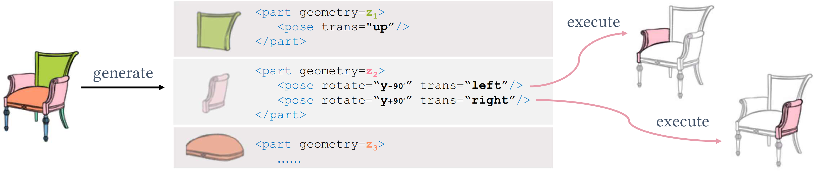
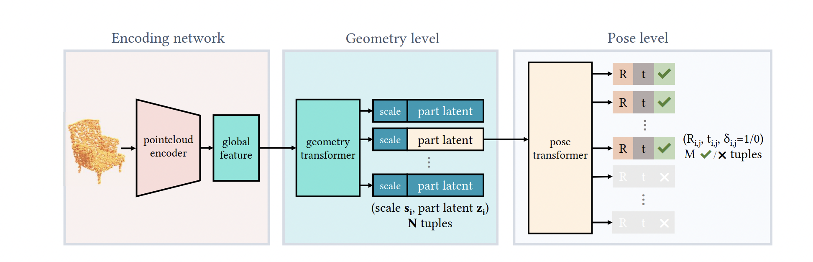
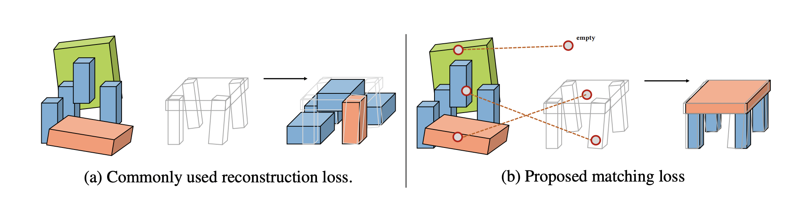
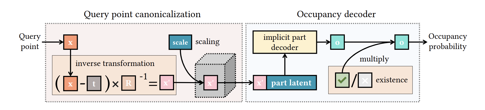
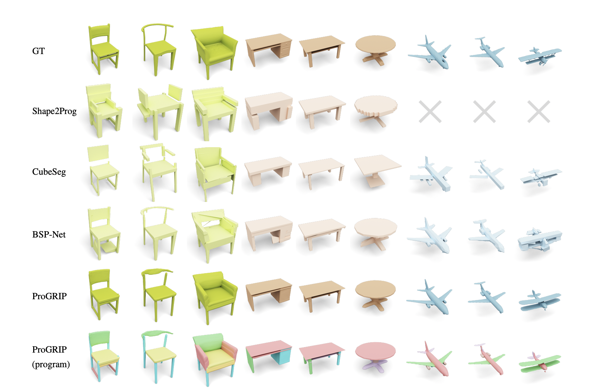
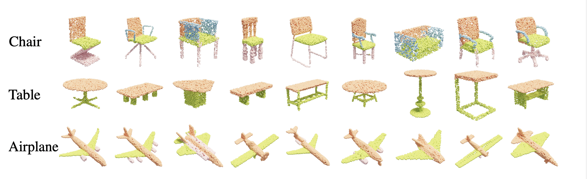

# Unsupervised Learning for Cuboid Shape Abstraction via Joint Segmentation from Point Clouds

This repository is a PyTorch implementation for paper:
[Unsupervised Learning for Cuboid Shape Abstraction via Joint Segmentation from Point Clouds](https://arxiv.org/abs/2106.03437). 


[Project Page](https://progrip-project.github.io/)

<br>
Kaizhi Yang, Xuejin Chen
<br>
NIPS2023

## Introduction
Shape programs encode shape structures by representing object parts as subroutines and constructing the overall shape by composing these subroutines. This usually involves the reuse of subroutines for repeatable parts, enabling the modeling of correlations among shape elements such as geometric similarity. However, existing learning-based shape programs suffer from limited representation capacity because they use coarse geometry representations such as geometric primitives and low-resolution voxel grids. Further, their training requires manually annotated ground-truth programs, which are expensive to attain. We address these limitations by proposing Shape Programs with Repeatable Implicit Parts (ProGRIP). Using implicit functions to represent parts, ProGRIP greatly boosts the representation capacity of shape programs while preserving the higher-level structure of repetitions and symmetry. Meanwhile, we free ProGRIP from any inaccessible supervised training via devising a matching-based unsupervised training objective. Our empirical studies show that ProGRIP outperforms existing structured representations in shape reconstruction fidelity as well as segmentation accuracy of semantic parts.




This paper use the ProGRIP model to create a structured representation of a input point cloud. This model consists several components: 1) the point cloud encoder that take the input point cloud and encode the batch to latent vectors. Later, two transformers are applied to predict the (potentilly) reusable parts to describe the point cloud and the possible poses of these resuable parts. Then, the model use a matching loss to supervise how good the predicted set describe the point cloud. Note that it requries another point cloud model to predict the cuboid abstraction (luciliy this pretrained model is fully unsupervised).

## General Framework

The ProGRIP model consists a point cloud encoder that transforms the structure of the point cloud into a vector representation.

### Encoder
This model use a point cloud encoder to construct the vector representation of the input point cloud. Specific model is not listed here.

### Decoder
Unlike the sequential programs in previous works, we introduce *parallelism* into our program, allowing repeatable parts to be executed simutaneously wiht out a specified order. Specifically, our program generator takes as input a point cloud $X\in R^{Px3}$ with $P$ points and interprets is as a ProGRIP using an auto-encoding architeture. A ProGRIP consists of two level hierarchy.


## Training
The training of the ProGRIP model consists of two stages, the first stage is for matching and the second stage if for the execution of implicit models.
**matching-loss**

**execution-loss**
In second stage of training, we have a model that predicts a set of boxes that corresponds to the cuboid abstraction of the input pointcloud. Now the model train the contents in the matched box. ProGRIP use a implicit neural net (MLP) to encode the geometric parts.

The occupany function take the render coordinate and a latent vector as the input. The coorindate represents the region to render and is transformed by the parameters determined by the matching box prediction. Then the occupany decoder take the geometric latent as input and output occupany at that point.
```math
o_{i,j}(x) = \hat{\delta}_{i,j}\mathcal{P}((R^{-1}_{i,j}(x-t_{i,j}))/s_i|z_i)
```
Note that we binarize $\delta_{i,j}$ to $\hat{\delta_{i,j}}$ in the equation abovem given a query point, we first canonicalize its coordinates to $x'=(R^{-1}_{i,j}(x-t_{i,j}))/s_i$. Then we feed $x'$ to $\mathcal{P}$ together with the shape code $z_i$. Then binarized existence probability $\hat{\delta_{i,j}}$ is finally multiplied to the predicted occupancy, masking out the non-existence primitives. THe eventual output of the program is an object shape as the union of posed parts. The object occupancy function can therefore be written as
```math
\mathcal{O}(x) = \max_i \max_j o_{i,j}(x)
```

## Results
Here are some results from the shape net dataset. We qualitatively compare ProGRIP with state-of-art shape decomposition (includeing Shape2Prog, CubeSeg, and BSP-Net) by rendering out their reconstructions. For ProGRIP, we present both plains reconstruction as well as per part colored rendering. The ground truth mesh is shown in the first row. ProGRIP reconstructs shapes more accurately and smoothly. Note that the cylindrical parts on the chair back are reconstucted as different copies of the same shape as 4 chair legs for their geometric similarity. Meanwhile, since there are asymetric table legs in ShapeNet, out method discovers symmetries for left and right legs independently.


 We visualize the unsupervised parts segmentation results produce by out ProGRIP, which generalizes well across different object categories. Besides, ProGRIP is capable of segmenting fine-grained parts such as engines and tails of aircrafts.


## Dependencies
* Python 3.8.8.
* CUDA 10.2.
* PyTorch 1.5.1.
* TensorboardX for visualization of the training process.

## Dataset
We provide the ready-to-use datasets:
>[Dataset](https://drive.google.com/file/d/18ngs7hefXOptpuEHrLzeTUCT0Vn1Ou4l/view?usp=sharing)

Please unzip this file and set its path as the argument ```E_shapenet4096```.

## Pretrain models
>[Pretrain models](https://drive.google.com/file/d/1JQ0PC4cvHm_vELQbik1v9pErTVg9nxG6/view?usp=sharing)


## Training
```
python E_train.py --E_shapenet4096 PATH_TO_SHAPENET4096 --E_ckpts_folder PATH_TO_SAVE --D_datatype DATA_TYPE
```

## Inference
```
python E_infer.py --E_shapenet4096 PATH_TO_SHAPENET4096 --E_ckpt_path DIRECTORY_TO_CHECKPOINT --checkpoint CHECKPOINT_NAME
```

## Cite
Please cite our work if you find it useful:
```
@misc{yang2021unsupervised,
    title={Unsupervised Learning for Cuboid Shape Abstraction via Joint Segmentation from Point Clouds},
    author={Kaizhi Yang and Xuejin Chen},
    year={2021},
    eprint={2106.03437},
    archivePrefix={arXiv},
    primaryClass={cs.CV}
}
```

## License
MIT License
